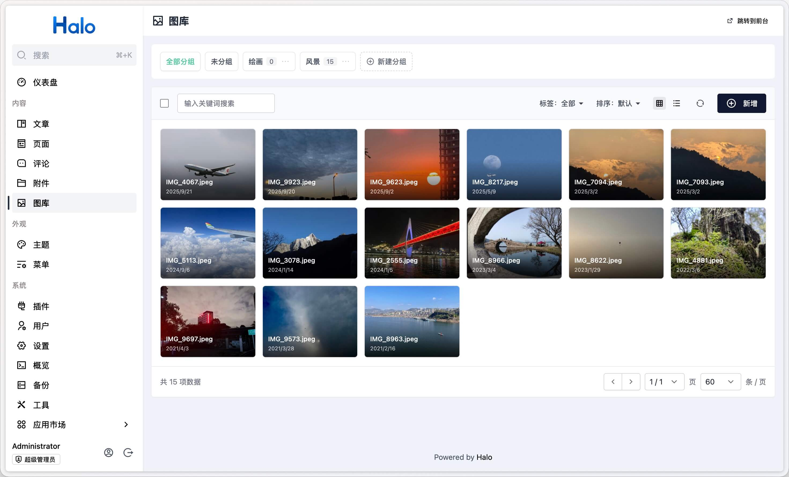

# plugin-photos

> **注意：当前 README 为 2.0.0 测试版文档。如需查阅稳定版文档，请访问：[v1.6.1 分支 README](https://github.com/halo-sigs/plugin-photos/tree/v1.6.1)**

Halo 2.0 的相册管理插件，支持在 Console 进行管理，并为主题端提供 `/photos` 页面路由和 Finder API。

## 功能特性

- 支持为图片设置名称、描述、链接、封面、标签和分组
- 上传图片时自动读取 EXIF 信息，包括拍摄设备（相机品牌/型号、镜头）、拍摄参数（光圈、快门、ISO、焦距等）及图片尺寸
- 主题端 `/photos` 列表路由和 `/photos/{name}` 详情路由
- 提供匿名可访问的公共 REST API，方便前端框架构建客户端渲染图库

## 安装使用

1. 下载，目前提供以下两个下载方式：
    - GitHub Releases：访问 [Releases](https://github.com/halo-sigs/plugin-photos/releases) 下载 Assets 中的 JAR 文件。
    - Halo 应用市场：<https://halo.run/store/apps/app-BmQJW>
2. 安装，插件安装和更新方式可参考：<https://docs.halo.run/user-guide/plugins>
3. 安装完成之后，访问 Console 左侧的**图库**菜单项，即可进行管理。
4. 前台访问地址为 `/photos`，需要注意的是，此插件需要主题提供模板（`photos.html`）才能访问 `/photos`。

## 主题适配

此插件为主题端提供了：

- **列表路由** `/photos`（模板 `photos.html`）和**详情路由** `/photos/{name}`（模板 `photo.html`）
- **Finder API**（`photoFinder`）：可在主题任意位置渲染图库，无需依赖路由页面
- **公共 REST API**：供前端框架构建客户端渲染图库使用

详细的主题适配文档请参考：

- [主题 API 文档](./dev/theme-api.md) — 模板路由、模板变量、Finder API、类型定义
- [REST API 文档](./dev/rest-api.md) — 公共 API 和 Console API

## 开发文档

- [开发环境搭建](./dev/development.md) — 本地开发、构建、测试